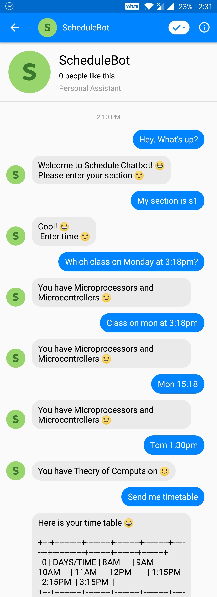
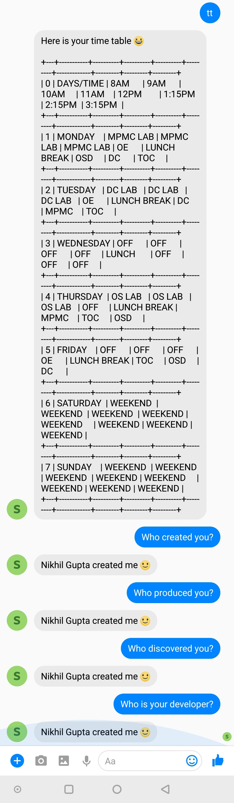

# Schedule Bot v1.0

### An assistant that will help users know their daily schedule with just a message 

In this project I've created a chatbot based on Facebook Messenger platform which initially takes input from a user and then stores it in database. After that user send some message to the Bot's Messenger account, and then the bot extracts the data from database and shows it to user. User can also ask some basic questions like 'what's the weather like today' and the bot will send the weather forecast based on your location. This include Natural Language Processing(NLP).  

The client side of this project uses a messenger platform to display results whereas the server side code is written in Python along with flask. Regarding database I had used SQLite3 as it runs locally i.e. it does not require any server to run. Hence it's very stable and fast.

## Getting Started

You can find the bot by either searching for @urschedulebot in Facebook Messenger app or by following the **[link.](https://m.me/urschedulebot/)**  
Great the you found the bot !  
Start Chatting xD

## Some glimpses of schedule bot in action :D

<!-- 
 -->

<table>
<tr>
<td>

</td>
<td>

</td>
</tr>
</table>

## Authors

* **[Nikhil Gupta](https://github.com/nguptaa)**

## License

This project is licensed under the MIT License - see the [LICENSE.md](LICENSE.md) file for details.

## Acknowledgments

* **Nikhil Kumar Singh** - *Github [repo](https://github.com/nikhilkumarsingh/NewsBot).* 
* **[Stack Overflow](https://stackoverflow.com)** - *Where Developers Learn, Share, & Build Careers.*
* **Steve Jobs** - *The only way to do great work is to love what you do. If you haven't found it yet, keep looking. Don't settle.*